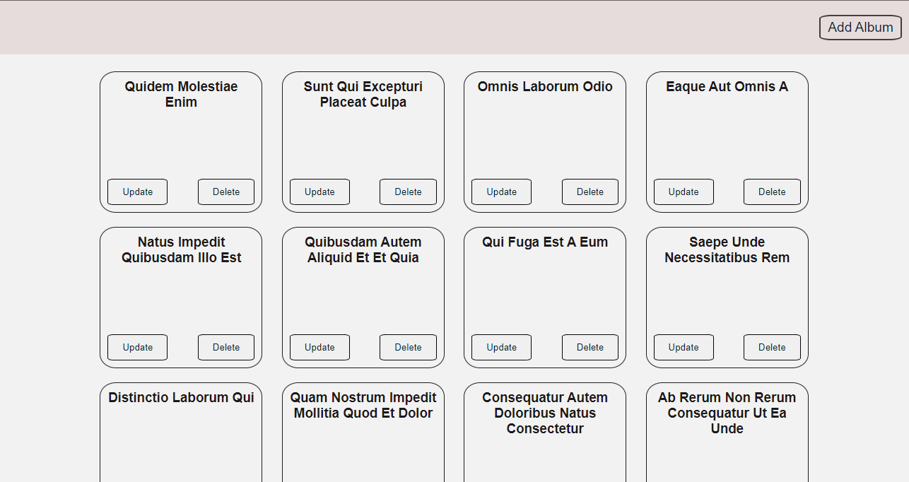

# React Album List



A small React app that lists albums fetched from the [JSONPlaceholder](https://jsonplaceholder.typicode.com/) fake REST API and lets you add, update and delete them.

This project was bootstrapped with [Create React App](https://github.com/facebook/create-react-app).

## Features

- Fetches the album list from `https://jsonplaceholder.typicode.com/albums` on load and shows each album title.
- **Add Album** page (`/add-album`): enter a title to add a new album to the list.
- **Update Album** page (`/update-album`): change the title of an existing album.
- **Delete** button on each album to remove it from the list.

Add, update and delete requests are sent to JSONPlaceholder (POST, PUT and DELETE), but JSONPlaceholder does not actually store changes. The app keeps changes only in its local React state, so they are lost when the page is reloaded.

## Tech Stack

- React 18 (class and function components)
- React Router v6 (`react-router-dom`)
- Create React App (`react-scripts` 5)
- Plain CSS (`src/index.css`)

## Project Structure

```
React-Album-List/
├── public/
│   └── index.html          # HTML template
├── src/
│   ├── components/
│   │   ├── App.js          # State, API calls and routes
│   │   ├── AlbumsList.js   # Home page: list of albums
│   │   ├── List.js         # A single album with Update/Delete buttons
│   │   ├── AddAlbum.js     # Add album form
│   │   ├── UpdateAlbum.js  # Update album form
│   │   └── Navbar.js       # Navigation button
│   ├── index.css
│   └── index.js            # Entry point (BrowserRouter + App)
├── album-list-pic.png      # Screenshot
└── package.json
```

## Prerequisites

- [Node.js](https://nodejs.org/) and npm
- An internet connection (album data is loaded from JSONPlaceholder)

## Installation

```bash
git clone https://github.com/iSouvikKhan/React-Album-List.git
cd React-Album-List
npm install
```

## Available Scripts

In the project directory, you can run:

### `npm start`

Runs the app in the development mode.\
Open [http://localhost:3000](http://localhost:3000) to view it in your browser.

The page will reload when you make changes.\
You may also see any lint errors in the console.

### `npm test`

Launches the test runner in the interactive watch mode. Note that the project currently contains no test files.\
See the section about [running tests](https://facebook.github.io/create-react-app/docs/running-tests) for more information.

### `npm run build`

Builds the app for production to the `build` folder.\
It correctly bundles React in production mode and optimizes the build for the best performance.

The build is minified and the filenames include the hashes.\
Your app is ready to be deployed!

See the section about [deployment](https://facebook.github.io/create-react-app/docs/deployment) for more information.

### `npm run eject`

**Note: this is a one-way operation. Once you `eject`, you can't go back!**

If you aren't satisfied with the build tool and configuration choices, you can `eject` at any time. This command will remove the single build dependency from your project.

Instead, it will copy all the configuration files and the transitive dependencies (webpack, Babel, ESLint, etc) right into your project so you have full control over them. All of the commands except `eject` will still work, but they will point to the copied scripts so you can tweak them. At this point you're on your own.

You don't have to ever use `eject`. The curated feature set is suitable for small and middle deployments, and you shouldn't feel obligated to use this feature. However we understand that this tool wouldn't be useful if you couldn't customize it when you are ready for it.

## Usage

1. Start the app with `npm start` and open http://localhost:3000.
2. The home page shows all albums. Click **Delete** to remove one, or **Update** to edit its title.
3. Click **Add Album** in the top bar, enter a title and click **Add To List**.
4. Use the **Home** button to go back to the list.

## Learn More

You can learn more in the [Create React App documentation](https://facebook.github.io/create-react-app/docs/getting-started).

To learn React, check out the [React documentation](https://reactjs.org/).

### Code Splitting

This section has moved here: [https://facebook.github.io/create-react-app/docs/code-splitting](https://facebook.github.io/create-react-app/docs/code-splitting)

### Analyzing the Bundle Size

This section has moved here: [https://facebook.github.io/create-react-app/docs/analyzing-the-bundle-size](https://facebook.github.io/create-react-app/docs/analyzing-the-bundle-size)

### Making a Progressive Web App

This section has moved here: [https://facebook.github.io/create-react-app/docs/making-a-progressive-web-app](https://facebook.github.io/create-react-app/docs/making-a-progressive-web-app)

### Advanced Configuration

This section has moved here: [https://facebook.github.io/create-react-app/docs/advanced-configuration](https://facebook.github.io/create-react-app/docs/advanced-configuration)

### Deployment

This section has moved here: [https://facebook.github.io/create-react-app/docs/deployment](https://facebook.github.io/create-react-app/docs/deployment)

### `npm run build` fails to minify

This section has moved here: [https://facebook.github.io/create-react-app/docs/troubleshooting#npm-run-build-fails-to-minify](https://facebook.github.io/create-react-app/docs/troubleshooting#npm-run-build-fails-to-minify)
